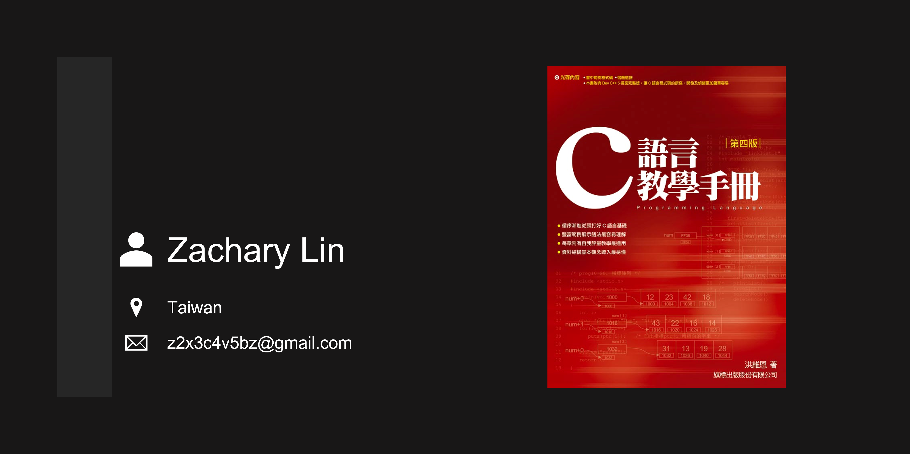

# C 語言教學手冊 第四版 (習題個人解答) #

[](https://github.com/z2x3c4v5bz/Learning--C_intro_4th_ed/issues)
[](https://github.com/z2x3c4v5bz/Learning--C_intro_4th_ed/network)
[](https://github.com/z2x3c4v5bz/Learning--C_intro_4th_ed/stargazers)
[](https://github.com/z2x3c4v5bz/Learning--C_intro_4th_ed/releases)
[](https://github.com/z2x3c4v5bz/Learning--C_intro_4th_ed/blob/master/LICENSE)

## Abstract ##

**Title:** C 語言教學手冊 第四版

**Auther:** 洪維恩

**Introduction:**

>- 循序漸進從頭打好 C 語言基礎
>- 豐富範例展示語法最容易理解
>- 每章附有自我評量教學最適用
>- 資料結構基本觀念導入最易懂



※ 原諒我題目內不附圖示。

※ 請留意，文中數學公式在瀏覽器頁面中可能無法正確顯示。

※ 圖書封面、內容皆為版權作者、出版商所有，本站所刊內容僅供教育、學習使用。

## Table of Contents ##

- [C 語言教學手冊 第四版 (習題個人解答)](#c-語言教學手冊-第四版-習題個人解答)
  - [Abstract](#abstract)
  - [Table of Contents](#table-of-contents)
  - [Chapter 01 -- 認識 C 語言](#chapter-01----認識-c-語言)
  - [Chapter 02 -- C 語言基本概述](#chapter-02----c-語言基本概述)
  - [Chapter 03 -- 基本資料型態](#chapter-03----基本資料型態)
  - [Chapter 04 -- 格式化的輸出與輸入](#chapter-04----格式化的輸出與輸入)
  - [Chapter 05 -- 運算子、運算式與敘述](#chapter-05----運算子運算式與敘述)
  - [Chapter 06 -- 選擇性敘述](#chapter-06----選擇性敘述)
  - [Chapter 07 -- 迴圈](#chapter-07----迴圈)
  - [Chapter 08 -- 函數](#chapter-08----函數)
  - [Chapter 09 -- 陣列與字串](#chapter-09----陣列與字串)
  - [Chapter 10 -- 指標](#chapter-10----指標)
  - [Chapter 11 -- 結構與其他資料型態](#chapter-11----結構與其他資料型態)
  - [Chapter 12 -- 檔案處理](#chapter-12----檔案處理)
  - [Chapter 13 -- 大型程式的發展](#chapter-13----大型程式的發展)
  - [Chapter 14 -- 動態記憶體配置與鏈結串列](#chapter-14----動態記憶體配置與鏈結串列)
  - [Chapter 15 -- 位元處理](#chapter-15----位元處理)
  - [Chapter 16 -- 邁向 C++ 之路](#chapter-16----邁向-c-之路)

## Chapter 01 -- 認識 C 語言 ##

>- C 語言概述
>- 程式的規劃與實作
>- 撰寫第一個 C 程式
>- 編譯與執行的過程
>- 本書的編排與慣例

### [Question 1-13](ch01/hw1_13/hw1_13.c) ###

>試修改 prog1_1，使得它可以印出 "`我愛C語言`" 一行中文字。

### [Question 1-14](ch01/hw1_14/hw1_14.c) ###

>試修改 prog1_1，使得它可以印出 "`我愛C語言`" 及 "`這是我的第一個C語言程式`"兩行中文字。

### [Question 1-15](ch01/hw1_15/hw1_15.c) ###

>試撰寫一程式，利用 `printf()` 函數印出下面的圖案（不須使用迴圈，每一列星號請用一個 `printf()` 函數來列印）：

### [Question 1-16](ch01/hw1_16/hw1_16.c) ###

>試以 `printf()` 函數印出下面的圖案（不需使用迴圈，每一列星號請用一個 `printf()` 函數來列印）：

### [Question 1-17](ch01/hw1_17/hw1_17.c) ###

>試撰寫一程式，利用 `printf()` 函數以星號和空白字元印出下面的圖案：

[](#table-of-contents)

## Chapter 02 -- C 語言基本概述 ##

>- 簡單的例子
>- 解析 C 語言
>- 識別字與關鍵字
>- 偵錯
>- 提高程式的可讀性

### [Question 2-3](ch02/hw2_3/hw2_3.c) ###

>試寫一個程式，可以列印出 "`You are my best friend.`" 字串。

### [Question 2-4](ch02/hw2_4/hw2_4.c) ###

>試寫一個程式，可以印出如下的輸出結果：
>
>```text
>See you tomorrow.
>Have a good night.
>```

### [Question 2-5](ch02/hw2_5/hw2_5.c) ###

>試寫一程式，可計算 $5 + 12$ 的值，並將結果列印出來。

### [Question 2-6](ch02/hw2_6/hw2_6.c) ###

>試寫一程式，可計算 $6 + 7 + 24$ 的值，並將結果列印出來。

### [Question 2-7](ch02/hw2_7/hw2_7.c) ###

>試在您所使用的 C 語言開發環境裡找出 `stdio.h` 與 `stdlib.h` 這兩個檔案，請將它們的內容分別拷貝起來，然後分別貼在 hw2_1.c 裡的第 2 行與第 3 行的位置，取代掉
>
>```C
>#include <stdio.h>
>#include <stdlib.h>
>```
>
>這兩行，最後再編譯之。
>
>以上的動作事實上就是編譯器所做的 "含括" 動作，只是現在是以手動方式將 `stdio.h` 與 `stdlib.h` 這兩個檔案含括進來罷了！如果執行本範例，您是否會得到與習題 1 相同的結果？

### [Question 2-8](ch02/hw2_8/hw2_8.c) ###

>試仿照習題 7 的步驟，將 prog2_2 重新編譯並執行之。

### [Question 2-10](ch02/hw2_10/hw2_10.c) ###

>試修改 prog2_2，使得第 9 行與第 10 行可以合併成一行來撰寫。

### [Question 2-11](ch02/hw2_11/hw2_11.c) ###

>試以 printf() 函數印出如下的圖案：

### [Question 2-20](ch02/hw2_20/hw2_20.c) ###

>下面是一個簡單的 C 程式碼，但程式的編排方式並不易於閱讀。請重新編排它來提高程式的可讀性：
>
>```C
>/* hw2_20.c, 基本程式的練習 */
>#include <stdio.h>
>#include <stdlib.h>
>int main(void){int i=5;
>printf("%d+%d=%d\n",i,i,i+i);
>system("pause");return 0; }
>```

### [Question 2-21](ch02/hw2_21/hw2_21.c) ###

>接續習題 20，試將習題 20 重新編排後，再加上適當註解，使得程式碼更具可讀性。

[](#table-of-contents)

## Chapter 03 -- 基本資料型態 ##

>- 變數與常數
>- 基本資料型態
>- 查詢常數、變數或資料型態所佔位元組
>- 資料型態的轉換

### [Question 3-2](ch03/hw3_2/hw3_2.c) ###

>試修改 prog3_1，使得第 9 行與第 10 行可分別印出 `num1` 與 `num2` 的平方值。第 9 行與第 10 行的輸出結果應如下所示：
>
>```text
>num1 的平方為 153760000
>num2 的平方為 27.394756
>```

### [Question 3-12](ch03/hw3_12/hw3_12.c) ###

>試寫一程式，利用設定字元變數 `ch` 為 ASCII 碼的方式讓電腦發出一個警告音（警告音的 ASCII 碼為 7）。

### [Question 3-14](ch03/hw3_14/hw3_14.c) ###

>請參閱下面的程式碼，然後回答接續的問題：
>
>```C
>/* hw13_14, 數字溢位的練習 */
>#include <stdio.h>
>#include <stdlib.h>
>int main(void)
>{
>    unsigned short num=80000;
>    printf("%d\n",num);
>    
>    system("pause");
>    return 0;
>}
>```
>
>(a) 試說明執行此程式的結果，為什麼是 `14464`，而不是 `80000` 這個數字？
>
>(b) 如果想讓本題第 7 行的執行結果恰好為 `80000`，應如何修改程式碼？

### Question 3-15 ###

- [Question 3-15a](ch03/hw3_15a/hw3_15a.c)
- [Question 3-15c](ch03/hw3_15c/hw3_15c.c)

>請參閱下面的程式碼，然後回答接續的問題：
>
>```C
>/* hw3_15, 數字精度的問題 */
>#include <stdio.h>
>#include <stdlib.h>
>int main(void)
>{
>    float num1=30000.1F;
>    float num2=0.0004F;
>    printf("%f\n",num1+num2);
>    
>    system("pause");
>    return 0;
>}
>```
>
>(a) 試執行此程式碼，您會得到什麼結果？
>
>(b) 於數學上，$30000.1 + 0.0004 = 30000.1004$，試說明執行此程式碼後，為什麼得不到這個結果？
>
>(c) 如果想讓本題的執行結果恰好為 `30000.1004`，應如何改進？試撰寫一個完整的程式碼來改進之。

### [Question 3-16](ch03/hw3_16/hw3_16.c) ###

>試撰寫一程式，利用 sizeof 關鍵字查詢下列各種資料型態所佔的位元組：
>
>(a) `unsigned int`
>
>(b) `double`
>
>(c) `unsigned short int`

### [Question 3-17](ch03/hw3_17/hw3_17.c) ###

>試撰寫一程式，利用 sizeof 關鍵字查詢下列各常數所佔的位元組：
>
>(a) `578`
>
>(b) `784000000`
>
>(c) `6.78f`
>
>(d) `718.26`
>
>(e) `6.42e127`

### [Question 3-18](ch03/hw3_18/hw3_18.c) ###

>假設浮點數變數 `num1` 與 `num2` 的值分別為 `123.39f` 與 `3.8e5f`，試撰寫一程式，將這兩個變數值轉換成整數。

### Question 3-19 ###

- [Question 3-19b](ch03/hw3_19b/hw3_19b.c)

>請參閱下面的程式碼，然後回答接續的問題：
>
>```C
>/* hw3_19, 型態轉換的練習 */
>#include <stdio.h>
>#include <stdlib.h>
>int main(void)
>{
>    int num1=5,num2=8;
>    printf("%d\n",num1/num2);
>    
>    system("pause");
>    return 0;
>}
>```
>
>(a) 試解釋第 7 行的輸出結果為何是 `0`？
>
>(b) 試修改程式碼，利用型態轉換的方式，使得第 7 行的輸出結果為 `0.625000`。

[](#table-of-contents)

## Chapter 04 -- 格式化的輸出與輸入 ##

>- 輸出函數 `printf()`
>- 輸入函數 `scanf()`
>- 使用 `scanf()` 函數應注意的事項
>- 輸出、輸入字元的函數

### [Question 4-1](ch04/hw4_1/hw4_1.c) ###

>試撰寫一程式，利用 `printf()` 函數列印出如下的字串：
>
>```text
>I love C language best.
>```

### [Question 4-2](ch04/hw4_2/hw4_2.c) ###

>試撰寫一程式，利用 `printf()` 函數列印出如下的字串（必須包含雙引號）：
>
>```text
>"I love C language best."
>```

### [Question 4-3](ch04/hw4_3/hw4_3.c) ###

>試嘗試利用一個 `printf()` 函數將字串常數 `"Hello, C"` 與 `"Hello, World"` 分別列印在不同一行（必須包含雙引號）。

### [Question 4-4](ch04/hw4_4/hw4_4.c) ###

>試撰寫一程式，利用 `printf()` 函數列印出如下的字串（必須包含雙引號）：
>
>```text
>"10/4=25"
>```

### [Question 4-5](ch04/hw4_5/hw4_5.c) ###

>試撰寫一程式，利用 `printf()` 函數列印出如下的字串（必須包含單引號）：
>
>```text
>'30% 的學生來自中部地區，42% 的學生來自南部地區。'
>```

### [Question 4-6](ch04/hw4_6/hw4_6.c) ###

>試撰寫一程式，將浮點數變數 `num = 28.47f` 以下圖的格式印出（小數點前面有 4 位，小數點後面有 2 位，不滿欄位長度時填入 0）：

### [Question 4-7](ch04/hw4_7/hw4_7.c) ###

>試撰寫一程式，將浮點數變數 `num = 12.34f` 以下圖的格式印出（小數點前面有 4 位，小數點後面有 2 位，不滿欄位長度時填入 0，並印出其變數的正負號）：

### [Question 4-8](ch04/hw4_8/hw4_8.c) ###

>試撰寫一程式，利用 `printf()` 函數將下列字串印出：
>
>```text
>There is an old saying, "Love me, love my dog."
>```

### [Question 4-10](ch04/hw4_10/hw4_10.c) ###

>試撰寫一程式，利用 `scanf()` 函數輸入兩個整數，然後以 `printf()` 函數列印出這兩個整數的乘積。

### [Question 4-11](ch04/hw4_11/hw4_11.c) ###

>試撰寫一程式，由鍵盤輸入學生的學號（整數型態）及年齡（整數型態），輸入完畢後將剛才所輸入的內容印出在螢幕中。

### [Question 4-12](ch04/hw4_12/hw4_12.c) ###

>試撰寫一程式，由使用者先輸入姓氏，再輸入名字，輸出時則先印出名字，再印出姓氏。

### [Question 4-13](ch04/hw4_13/hw4_13.c) ###

>試撰寫一程式，輸入一長度最多為 10，且不包括空白的字串，並做下列的處理。
>
>(a) 以雙引號將字串包圍。
>
>(b) 以反斜線 \ 將字串包圍，印出時的欄寬為 20。
>
>(c) 以反斜線 \ 將字串包圍，印出時的欄寬為 20，靠左印出。

### [Question 4-14](ch04/hw4_14/hw4_14.c) ###

>試撰寫一程式，由鍵盤輸入一個十進位的整數，然後印出該整數的八進位和十六進位。

### [Question 4-15](ch04/hw4_15/hw4_15.c) ###

>試撰寫一程式，由鍵盤輸入一個十六進位的整數，然後印出該整數的八進位和十進位。

### [Question 4-16](ch04/hw4_16/hw4_16.c) ###

>試著利用下面的程式，將字串 "`No more goodbye`" 輸入：
>
>```C
>/* hw4_16, 輸入字串的錯誤 */
>#include <stdio.h>
>#include <stdlib.h>
>int main(void)
>{
>    char str[25];
>    
>    printf("Input a string:");
>    scanf("%s",str);
>    printf("The string is %s\n",str);
>    
>    system("pause");
>    return 0;
>}
>```
>
>(a) 根據執行的結果，您發現了什麼？為什麼會有這樣的執行結果？
>
>(b) 試撰寫程式碼，可以將本例中，由鍵盤所輸入的 "`No more goodbye`" 字串裡所有的英文字母全部讀出，並列印出來。

### Question 4-17 ###

- [Question 4-17b](ch04/hw4_17/hw4_17b.c)
- [Question 4-17c](ch04/hw4_17/hw4_17c.c)

>請先執行下面的程式碼，然後回答接續的問題：
>
>```C
>/* hw4_17, 輸入字串的錯誤 */
>#include <stdio.h>
>#include <stdlib.h>
>int main(void)
>{
>    char ch1,ch2;
>    
>    printf("請輸入第一個字元:");
>    scanf("%c",&ch1);
>    printf("請輸入第二個字元:");
>    scanf("%c",&ch2);
>    printf("ch1=%c, ch2=%c\n",ch1,ch2);
>    
>    system("pause");
>    return 0;
>}
>```
>
>(a) 試說明為什麼第二個字元無法順利輸入？
>
>(b) 試修改第 11 行的格式字串，使得本例中的第二個字元可以順利的輸入。
>
>(c) 試撰寫程式碼，利用 `fflush()` 函數來清空緩衝區內的資料，使得本例中的第二個字元可以順利的輸入。

### [Question 4-19](ch04/hw4_19/hw4_19.c) ###

>試修改 prog4_20 的第 14 行，以 `getchar()` 函數來取代。

### [Question 4-20](ch04/hw4_20/hw4_20.c) ###

>試修改 prog4_22，使得字元的輸出是利用 `putchar()` 函數，而不是 `printf()` 函數。

[](#table-of-contents)

## Chapter 05 -- 運算子、運算式與敘述 ##

>- 運算式與運算子
>- 運算子的優先順序
>- 運算式
>- 運算式的型態轉換

### Question 5-1 ###

- [Question 5-1a](ch05/hw5_1a/hw5_1a.c)
- [Question 5-1b](ch05/hw5_1b/hw5_1b.c)
- [Question 5-1c](ch05/hw5_1c/hw5_1c.c)

>請寫出下列程式的輸出結果，並撰寫完整的程式碼來驗證之：
>
>(a)
>
>```C
>/* hw5_1a, 運算式的練習 (一) */
>int a=8;
>printf("a=%d\n",++a);
>printf("a=%d\n",a--);
>```
>
>(b)
>
>```C
>/* hw5_1b, 運算式的練習 (二) */
>int a=10,b=20;
>a=a%5;
>b=b/6;
>printf("a=%d\n",a);
>printf("b=%d\n",b);
>```
>
>(c)
>
>```C
>/* hw5_1c, 運算式的練習 (三) */
>int a=20,b=5;
>a=20,b=5;
>a=a%b;
>b=b*3;
>printf("a=%d\n",a);
>printf("b=%d\n",b);
>```

### [Question 5-5](ch05/hw5_5/hw5_5.c) ###

>試計算下列各式，並撰寫程式碼來驗證您計算的結果：
>
>(a) `6%4`
>
>(b) `12%6`
>
>(c) `12%12`
>
>(d) `35%50`
>
>(e) `50%35`

### [Question 5-8](ch05/hw5_8/hw5_8.c) ###

>試計算下列各式，並撰寫程式碼來驗證您計算的結果：
>
>(a) `12-4%6/4`
>
>(b) `7*5%12*6/4`
>
>(c) `(13%6)/7*8`

### [Question 5-11](ch05/hw5_11/hw5_11.c) ###

>試撰寫一程式，可由鍵盤輸入攝氏溫度，程式的輸出為華氏溫度，其轉換公式如下：
>$$華氏溫度 = (9 ÷ 5) × 攝氏溫度 + 32$$

### [Question 5-12](ch05/hw5_12/hw5_12.c) ###

>根據上題所提供的轉換公式，撰寫轉換華氏（由鍵盤輸入）至攝氏溫度的程式。

### [Question 5-13](ch05/hw5_13/hw5_13.c) ###

>試撰寫一程式，可由鍵盤輸入英哩，程式的輸出為公里，其轉換公式如下：
>$$1 英哩 = 1.6 公里$$

### [Question 5-14](ch05/hw5_14/hw5_14.c) ###

>根據上題所提供的資訊，撰寫轉換公里（由鍵盤輸入）至英哩的程式。

### [Question 5-15](ch05/hw5_15/hw5_15.c) ###

>試撰寫一程式，可由鍵盤輸入平行四邊形的底和高，然後計算其面積。

### [Question 5-16](ch05/hw5_16/hw5_16.c) ###

>已知圓球體積為 $\frac{4}{3} \pi r^3$，試撰寫一程式，可輸入圓球半徑，經計算後輸出圓球體積。

[](#table-of-contents)

## Chapter 06 -- 選擇性敘述 ##

>- 我的程式會轉彎--`if` 敘述
>- 另外的選擇--`if-else` 敘述
>- 簡潔版的 `if-else` 敘述--條件運算子
>- 更好用的多重選擇--`switch` 敘述
>- 使用 `goto` 敘述

### [Question 6-1](ch06/hw6_1/hw6_1.c) ###

>試撰寫一程式，可由鍵盤讀入一個字元。若此字元是數字（即數字 0～9），則印出 "此字元是數字" 字串；若此字元是英文大小寫字母（即 a～z, A～Z），則印出 "此字元是英文字母" 字串。

### [Question 6-2](ch06/hw6_2/hw6_2.c) ###

>試修改 prog6_2 的程式碼，使得它也可以判別數字是等於 0 的情況。也就是說，可以判別輸入的整數是大於 0，等於 0，或小於 0 的情況。

### [Question 6-3](ch06/hw6_3/hw6_3.c) ###

>試撰寫一程式，可由鍵盤輸入一個整數，然後判斷它是奇數或偶數。

### [Question 6-4](ch06/hw6_4/hw6_4.c) ###

>試撰寫一程式，可由鍵盤輸入一整數，然後求此數的絕對值。

### [Question 6-5](ch06/hw6_5/hw6_5.c) ###

>試撰寫一程式，可由鍵盤輸入一個整數，（代表某個人的體重），然後判斷體重是不是過重。若體重大於 90 公斤，則印出 "`體重過重`"，否則印出 "`不會過重`"。

### [Question 6-6](ch06/hw6_6/hw6_6.c) ###

>試撰寫一程式，可由鍵盤輸入兩個整數，分別代表某個人的身高與體重，然後判斷他的體重是不是過重。若體重大於 90 公斤，且身高低於 180 公分，則印出 "`體重過重`"，否則印出 "`不會過重`"。

### [Question 6-7](ch06/hw6_7/hw6_7.c) ###

>試撰寫一程式，由程式中宣告並設定三個整數的初值，判斷這三個整數是否能構成三角形的三個邊長（註：三角形兩邊長之和必須大於第三邊）。

### [Question 6-8](ch06/hw6_8/hw6_8.c) ###

>接續習題 7，當三個邊長能夠構成三角形時，再判斷該三角形為鈍角、銳角或是直角三角形，其判別方法如下：
>
>>直角三角形：其中有兩個邊的平方和等於第三邊的平方
>>
>>鈍角三角形：其中有兩個邊的平方和小於第三邊的平方
>>
>>銳角三角形：任兩邊的平方和大於第三邊的平方

### [Question 6-9](ch06/hw6_9/hw6_9.c) ###

>試撰寫一程式，讀入 10 個學生的成績，成績在 0～59 分為 C，60～75 分為 B，76～100 分為 A，最後將得到 A、B、C 的人數印出。

### [Question 6-10](ch06/hw6_10/hw6_10.c) ###

>試撰寫一程式，輸入 $x$、$y$ 座標值，判斷該點位於哪一個象限或是在座標軸上。舉例來說，若輸入的座標值為 $(3.0, -2.5)$，輸出即為第四象限；若輸入的座標值為 $(4.5, 0.0)$，則輸出即為 $x$ 軸。

### [Question 6-11](ch06/hw6_11/hw6_11.c) ###

>假設某便利商店的工讀生的月薪資，可依照下列方式計算：
>
>>60 個小時之內，每小時 75 元
>>
>>61～75 個小時，以 1.25 倍計算
>>
>>76 個小時以後以 1.75 倍計算
>
>例如，如果工作時數為 80 小時，則薪資為 $60 × 75 + 15 × 75 × 1.25 + 5 × 75 × 1.75 = 6562.5$ 元。試撰寫一程式，於程式中設定某工讀生該月的工作時數（為一整數），然後計算實領的薪資。

### [Question 6-12](ch06/hw6_12/hw6_12.c) ###

>試利用 if-else-if 敘述設計一程式，程式的輸入為學生成績，輸出為成績的等級。學生成績依下列的分類方式分級：
>
>>80～100：A 級
>>
>>60～79：B 級
>>
>>0～59：C 級

### [Question 6-13](ch06/hw6_13/hw6_13.c) ###

>試撰寫一程式，可輸入月份，然後判斷其所屬的季節（3～5 月為春季，6～8 月為夏季，9～11 月為秋季，12～2 月為冬季）。

### [Question 6-14](ch06/hw6_14/hw6_14.c) ###

>試撰寫一程式，可由鍵盤讀入一個 4 個位數的整數，代表西洋的年份，然後判別這個年份是否為閏年（每四年一閏，每百年不閏，每四百年一閏，每四千年不閏，例如西元 1900 雖為 4 的倍數，但可被 100 整除，所以不是閏年，同理，2000 年是閏年，因可被 400 整除，而 2004 當然也是閏年，因可以被 4 整除）。

### [Question 6-15](ch06/hw6_15/hw6_15.c) ###

>假設在某商店中購物，輸入所應付款的金額及實際交給店員的金額，輸入則為應找回最少的鈔票數與錢幣數，如果交給店員的金額少於應付金額，則印出 "金額不夠" 字串。舉例來說，我們買了 33 元（所應付款的金額）的東西，而交給店員的錢為 1000 元（實際交給店員的金額），店員應找回一張 500 元，四張 100 元，一個 50 元硬幣，一個 10 元硬幣，一個 5 元硬幣及二個 1 元硬幣（假設幣值只有 1000、500、100、50、10、5 與 1 元）。

### [Question 6-16](ch06/hw6_16/hw6_16.c) ###

>已知一元二次方程式 $ax^2 + bx + c = 0$ 的解為
>
>$$x = \frac{-b ± \sqrt{b^2 - 4ac}}{2a}$$
>
>試撰寫一程式，由程式中宣告並設定 a、b、c 三個浮點數的初值，代表方程式 $ax^2 + bx + c = 0$ 的係數，然後利用判別式 $b^2 - 4ac$ 的值來計算方程式的根。
>
>>【註】
>>
>>當 $b^2 - 4ac > 0$ 方程式有二個實根，$x = \frac{-b ± \sqrt{b^2 - 4ac}}{2a}$。
>>
>>當 $b^2 - 4ac = 0$ 方程式有兩個相等實根，$x = - \frac{b}{2a}$。
>>
>>當 $b^2 - 4ac < 0$ 則沒有實根，印出 "`沒有實根`" 字串。
>
>（開根號請用 `sqrt()` 函數，注意 `sqrt()` 的引數型態為 `double`，傳回值也是 `double`。使用 `sqrt()` 函數時必須含括入 `math.h` 標頭檔）

### [Question 6-17](ch06/hw6_17/hw6_17.c) ###

>試將習題 5 改用條件運算子來撰寫。

### [Question 6-18](ch06/hw6_18/hw6_18.c) ###

>試將習題 6 改用條件運算子來撰寫。

### [Question 6-19](ch06/hw6_19/hw6_19.c) ###

>如果編譯下面的程式碼，則會有錯誤訊息發生。試指出錯誤之所在，並試著訂正之：
>
>```C
>/* hw6_19, 條件運算子的練習 */
>#include <stdio.h>
>#include <stdlib.h>
>int main(void)
>{
>    int a = 4, b = 6, larger;
>
>    a > b ? larger = a : larger = b; /* 條件運算子 */
>    printf("%d 數值較大\n", larger);
>
>    system("pause");
>    return 0;
>```

### [Question 6-20](ch06/hw6_20/hw6_20.c) ###

>試由鍵盤輸入數值 1～4，並加以判斷輸入值是否在 1～4 之間，如果超出此範圍，則輸出 "`輸入錯誤`"，否則利用 `switch` 印出相對應的季節：
>
>>1：春天
>>
>>2：夏天
>>
>>3：秋天
>>
>>4：冬天

### [Question 6-21](ch06/hw6_21/hw6_21.c) ###

>試由鍵盤輸入一個字元，然後加以判斷輸入的字元是小寫的 a 還是小寫的 b。若是小寫的 a，則印出 "`您輸入 a`"，若是小寫的 b，則印出 "`您輸入 b`"，若輸入的字元不是 a 或 b，則印出 "`您輸入的不是 a 或 b`"。

### [Question 6-22](ch06/hw6_22/hw6_22.c) ###

>試修改習題 21，使得輸入的不論是 a 或 A，都印出 "`您輸入的是 A`"，而不論是 b 或 B，都印出 "`您輸入的是 B`"，否則印出 "`您輸入的不是 A 或 B`"。

### [Question 6-23](ch06/hw6_23/hw6_23.c) ###

>試由鍵盤輸入一個 1～7 之間的整數，代表星期一到星期日。若輸入的是 1～5，則印出 "`今天要上班`"，若輸入的是 6～7，則印出 "`今天休息`"，若輸入的不是 1～7，則印出 "`輸入錯誤`"。

### [Question 6-24](ch06/hw6_24/hw6_24.c) ###

>試利用 `goto` 敘述撰寫一程式，可以計算 1～100 之間，所有奇數的總和。

### [Question 6-25](ch06/hw6_25/hw6_25.c) ###

>試利用 `goto` 敘述撰寫一程式，找出 1900～2000 之間，所有的閏年。關於閏年的判別，請參考習題 14。

### [Question 6-26](ch06/hw6_26/hw6_26.c) ###

>試修改習題 20，使得當輸入的數值不是在 1～4 之間，則會要求重新輸入（請利用 `goto` 敘述來完成）。

[](#table-of-contents)

## Chapter 07 -- 迴圈 ##

>- 結構化程式設計
>- 使用 `for` 迴圈
>- 使用 `while` 迴圈
>- 使用 `do while` 迴圈
>- 空迴圈
>- 我要使用哪一種迴圈？
>- 巢狀迴圈
>- 迴圈的跳離

### [Question 7-3](ch07/hw7_3/hw7_3.c) ###

>試利用 `for` 迴圈計算 $1 + 3 + 5 + ... + n$ 的總和，其中 $n$ 為奇數，可由使用者自行輸入。

### [Question 7-4](ch07/hw7_4/hw7_4.c) ###

>試撰寫一程式，利用 `for` 迴圈列印 ASCII 碼為 41～64 之間的字元。

### [Question 7-5](ch07/hw7_5/hw7_5.c) ###

>試撰寫一程式，求整數 1～100 中，可以同時被 3 與 8 整除之所有整數的總和。

### [Question 7-6](ch07/hw7_6/hw7_6.c) ###

>試撰寫一程式，由鍵盤輸入一個正整數，然後求其所有的因數，例如輸入 24，則印出 24 的所有因數 1、2、3、4、6、8、12 與 24。

### [Question 7-7](ch07/hw7_7/hw7_7.c) ###

>試撰寫一程式，利用 `for` 迴圈印出從 1 到 100 之間，所有可以被 6 整除的數值。

### [Question 7-8](ch07/hw7_8/hw7_8.c) ###

>試撰寫一程式，利用 `for` 迴圈印出從 1 到 100 之間，所有可以被 7 整除，又可以被 3 整除的數值。

### [Question 7-9](ch07/hw7_9/hw7_9.c) ###

>試撰寫一程式，利用 `for` 迴圈計算 $1^2 - 2^2 + 3^2 - 4^2 + ... + 47^2 - 48^2 + 49^2 - 50^2$ 的值。

### [Question 7-10](ch07/hw7_10/hw7_10.c) ###

>試撰寫一程式，利用 `for` 迴圈計算 $1 + \frac{1}{2} + \frac{1}{3} + ... + \frac{1}{n}$ 的總和，其中 $n$ 值可自行輸入。

### [Question 7-11](ch07/hw7_11/hw7_11.c) ###

>一個數如果恰好等於它的因數之和，這個數就稱為 "完美數"（perfect number）。例如 $6 = 1 + 2 + 3$，因 1、2 與 3 都是 6 的因數，因而 6 是完美數。試撰寫一程式，找出 1000 以內的所有完美數。

### [Question 7-12](ch07/hw7_12/hw7_12.c) ###

>所謂 "Armstrong 數" 是指一個三位數的整數，其各位數字之立方和等於該數本身。例如：153 是一個 Armstrong 數，因為 $153 = 1^3 + 5^3 + 3^3$。試撰寫一程式，找出所有的 Armstrong 數。

### [Question 7-13](ch07/hw7_13/hw7_13.c) ###

>試利用 `while` 迴圈計算 $2 + 4 + 6 + ... + n$ 的總和，其中 $n$ 為正的偶數，可由使用者自行輸入。若輸入的值不是正偶數，則程式會要求使用者再次輸入，直到輸入的數是正偶數為止。

### [Question 7-14](ch07/hw7_14/hw7_14.c) ###

>假設有一條繩子長 3000 公尺，每天剪去一半的長度，請問需要花費幾天的時間，繩子的長度會短於 5 公尺？

### [Question 7-16](ch07/hw7_16/hw7_16.c) ###

>試修改 prog7_5 中，使得無論按下 Ctrl+Q（ASCII 的值為 17）或 Ctrl+C（ASCII 的值為 3），皆可跳離程式的執行。

### [Question 7-17](ch07/hw7_17/hw7_17.c) ###

>試撰寫一程式，利用 `while` 迴圈印出 1～10 之間所有整數的平方值，最後再印出這些平方值的總和。

### Question 7-18 ###

- [Question 7-18a](ch07/hw7_18a/hw7_18a.c)

>試依下面的題意作答：
>
>(a) 試利用 `do while` 迴圈，計算 $2 + 4 + 6 + ... + n$ 的總和，其中 $n$ 為正的偶數，可由鍵盤自行輸入。若輸入的不是正偶數，則程式會要求使用者再次輸入，直到輸入的數是正偶數為止。
>
>(b) 和習題 13 相比，您覺得哪一種迴圈較適合用來計算 $2 + 4 + 6 + ... + n$ 的總和？為什麼？

### [Question 7-19](ch07/hw7_19/hw7_19.c) ###

>試利用 `do while` 迴圈找出最小的 $n$ 值，使得 $1 + 2 + 3 + ... + n$ 的總和大於等於 1000。

### [Question 7-20](ch07/hw7_20/hw7_20.c) ###

>試撰寫一程式，由鍵盤分三次讀取 1 個整數，範圍在 1～50 之間；每讀取一個整數 $n$，就會列印出 $n$ 個 `*` 號。例如輸入 5，即印出 `*****`。

### [Question 7-21](ch07/hw7_21/hw7_21.c) ###

>於下面的程式碼片段中，原本預期會印出 3 行星號，但實際上卻只印出了一行。試說明程式錯誤之處，並修正之：
>
>```C
>/* hw7_21, 空迴圈的練習 */
>int i;
>for (i = 1; i <= 3; i++);
>    printf("*********\n");
>```

### [Question 7-22](ch07/hw7_22/hw7_22.c) ###

>於下面的程式碼片段中，第 4 行的敘述是否會被執行？為什麼？
>
>```C
>/* hw7_22, 空迴圈的練習 */
>int i = 0;
>while(i);
>    printf("Have a nice day!\n");
>```

### Question 7-23 ###

- [Question 7-23a](ch07/hw7_23a/hw7_23a.c)
- [Question 7-23b](ch07/hw7_23b/hw7_23b.c)

>試依下面的題意作答：
>
>(a) 試修改習題 19，把 `do while` 迴圈改以 `for` 迴圈來撰寫。
>
>(b) 試修改習題 19，把 `do while` 迴圈改以 `while` 迴圈來撰寫。
>
>(c) 您覺得習題 19 分別以 `for`、`while` 和 `do while` 迴圈來撰寫時，比較起來哪一種迴圈寫起來較方便？為什麼？

### Question 7-24 ###

- [Question 7-24a](ch07/hw7_24a/hw7_24a.c)

>試依下面的題意作答：
>
>(a) 試修改習題 20，把 `do while` 迴圈改以 `while` 迴圈來撰寫。
>
>(b) 您覺得習題 20 較適合用哪一種迴圈來撰寫？為什麼？

### [Question 7-25](ch07/hw7_25/hw7_25.c) ###

>試利用巢狀迴圈撰寫出一個能產生如下圖結果的程式。請先繪製出流程圖後，根據流程圖撰寫程式：
>
>```text
>1
>22
>333
>4444
>55555
>```

### [Question 7-26](ch07/hw7_26/hw7_26.c) ###

>試利用巢狀迴圈撰寫出一個能產生如下圖結果的程式：
>
>```text
>1
>12
>123
>1234
>12345
>```

### [Question 7-27](ch07/hw7_27/hw7_27.c) ###

>試利用巢狀迴圈撰寫出一個能產生如下圖結果的程式：
>
>```text
>     1
>    12
>   123
>  1234
>12345
>```

### [Question 7-28](ch07/hw7_28/hw7_28.c) ###

>試撰寫一程式，利用 `do while` 迴圈完成九九乘法表。

### [Question 7-29](ch07/hw7_29/hw7_29.c) ###

>試撰寫一程式，利用 `break` 敘述來撰寫 4 個數字之密碼輸入的過程。使用者有三次輸入的機會，並須滿足下列的條件：
>
>>(a) 如果密碼輸入不對，則會再次的出現 "`請輸入密碼:`" 字串。
>>
>>(b) 如果三次的輸入都不對，則程式會印出 "`密碼輸入超過三次!!`" 字串，然後結束程式的執行。
>>
>>(c) 如果輸入正確，則印出 "`密碼輸入正確，歡迎使用本系統!!`" 字串。
>
>本習題的部分程式碼如下，請將它補上該有的程式，以完成本題的需求：
>
>```C
>/* hw7_29, break 敘述的練習 */
>#include <stdio.h>
>#include <stdlib.h>
>int main(void)
>{
>    int input;            /* 用來儲存使用者輸入的密碼的變數 */
>    int cnt = 0;          /* 用來計數密碼輸入的次數的變數 */
>    int passwd = 6128     /* 預設正確的密碼為 6128 */
>
>    while(1)
>    {
>        printf("請輸入密碼: ");
>        scanf("%d", &input);
>        /* 請在此輸入程式碼，以完成本題的要求 */
>    }
>
>    system("pause");
>    return 0;
>}
>```

### [Question 7-30](ch07/hw7_30/hw7_30.c) ###

>試修改習題 29，把 10～15 行的 `while` 迴圈改以 `for` 迴圈來撰寫。

### [Question 7-31](ch07/hw7_31/hw7_31.c) ###

>試利用 `continue` 敘述，找出小於 100 的整數裡，所有可以被 2 與 3 整除，但不能被 12 整除的整數。

### [Question 7-32](ch07/hw7_32/hw7_32.c) ###

>試撰寫一程式，由鍵盤輸入一個整數，然後判別此數是否為質數（prime）。若是，則印出 "`此數是質數`" 字串，若不是，則印出 "`此數不是質數`" 字串（質數是指除了 1 和它本身之外，沒有其它的數可以整除它的數，例如，2, 3, 5, 7 與 11 等皆為質數）。

### [Question 7-33](ch07/hw7_33/hw7_33.c) ###

>試撰寫一程式，可由鍵盤讀入一個正整數，並找出小於此數的最大質數。

### [Question 7-34](ch07/hw7_34/hw7_34.c) ###

>老王養了一群兔子，但不知有幾隻。三隻三隻數之，剩餘一隻；五隻五隻數之，剩餘三隻；七隻七隻數之，剩餘二隻；試問最少有幾隻兔子？

[](#table-of-contents)

## Chapter 08 -- 函數 ##

>- 簡單的函數範例
>- 函數的基本架構
>- 更多的函數應用範例
>- 遞迴函數
>- 區域、全域與靜態變數
>- 引數傳遞的機制
>- 前置處理器--`#define`
>- 再來看看 `#include` 前置處理器

### [Question 8-1](ch08/hw8_1/hw8_1.c) ###

>試寫一函數 `void kitty(void)`，當主程式呼叫 `kitty()` 時，螢幕上會顯示 "`Hello Kitty`" 之字串。

### [Question 8-2](ch08/hw8_2/hw8_2.c) ###

>試撰寫 `void kitty(int k)` 函數，當主程式呼叫 `kitty(k)` 時，螢幕上會顯示出 $k$ 行的 "`Hello Kitty`"。

### [Question 8-3](ch08/hw8_3/hw8_3.c) ###

>試撰寫 `int cub(int x)` 函數，可用來傳回 $x$ 的 3 次方，並利用此函數來計算 `cub(2)`，即計算 $2^3$。

### [Question 8-4](ch08/hw8_4/hw8_4.c) ###

>試撰寫 `double square(double x)` 函數，可用來傳回 $x$ 的平方，並利用此函數來計算 `square(4.0)`，即計算 $4.0^2$。

### [Question 8-5](ch08/hw8_5/hw8_5.c) ###

>試撰寫 `int mod(int x, int y)` 函數，計算 $x / y$ 的餘數。並利用此函數來計算 `mod(17, 5)`，即計算 $\frac{17}{5}$ 的餘數。

### [Question 8-6](ch08/hw8_6/hw8_6.c) ###

>試撰寫函數 `int power(int x, int n)`，用來計算 $x$ 的 $n$ 次方，並於主程式裡計算 `power(5, 3)`，即計算 $5^3$。

### [Question 8-7](ch08/hw8_7/hw8_7.c) ###

>試撰寫函數 `int prime(int n)`，可用來找出第 $n$ 個質數（第一個質數為 2，第二個質數為 3，以此類推），並以此函數找出第 100 個質數。

### [Question 8-8](ch08/hw8_8/hw8_8.c) ###

>設 $f(x) = 3x^3 + 2x - 1$，試寫一函數 `double f(double x)`，用來傳回 $f(x)$ 的值，並於主程式裡分別計算 $f(-3.2)$、$f(-2.1)$、$f(0)$ 與 $f(2.1)$。

### [Question 8-9](ch08/hw8_9/hw8_9.c) ###

>試修改 prog8_7，使得當 $n = 1$ 時，`is_prime(n)` 會傳回 0（即判別 1 不是質數）。

### [Question 8-10](ch08/hw8_10/hw8_10.c) ###

>如果質數滿足 $2^p - 1$（$p$ 為正整數）的話，則該質數稱為梅森尼質數（Mersenne primes）。例如，7 是梅森尼質數，因 $p = 3$ 時，$2^3 - 1 = 7$。另外，11 就不是梅森尼質數，因為我們找不到一個整數 $p$，使得 $2^p - 1 = 11$。
>
>目前數學家搜尋更大質數的方法，許多都是利用電腦來檢驗梅森尼質數，在西元 1999 年六月，數學家用這這種方法發現了第 38 個梅森尼質數 $2^{26972593} - 1$，此數是當時所發現的最大質數！它是一個 2098960 位數，如果一張 A4 的紙可以印 5000 個數字，則這個質數必須印掉 420 張紙！
>
>現在請您撰寫程式碼，找出前 8 個梅森尼質數，並於主程式裡測試之。

### Question 8-11 ###

- [Question 8-11a](ch08/hw8_11a/hw8_11a.c)
- [Question 8-11b](ch08/hw8_11b/hw8_11b.c)
- [Question 8-11c](ch08/hw8_11c/hw8_11c.c)

>在《孫子算經》（此書約完成於西元 400 年左右）裡有個著名的「孫子問題」：
>
>>"今有物不知其數，三三數之剩二，五五數之剩三，七七數之剩二，問物幾何？"
>
>若把它翻譯成白話，便是：有一堆東西不知道有幾個；三個三個數它，剩餘二個；五個五個數它，剩餘三個；七個七個數它，剩餘二個；問這堆東西有幾個？
>
>(a) 試找出滿足孫子問題裡的最小整數。
>
>(b) 試撰寫一函數 `int find(int n)`，可以回傳滿足孫子問題裡的第 $n$ 個整數，然後利用此函數找出滿足孫子問題的第 5 個與第 7 個整數。
>
>(c) 試利用 (b) 所定義的函數找出前 12 個滿足孫子問題的整數。
>
>ps. 如果您對《孫子算經》的數學探討有興趣，可參考台大數學系蔡聰明教授所撰寫的「談韓信點兵問題」：<http://episte.math.ntu.edu.tw/articles/sm/sm_29_09_1>

### Question 8-12 ###

- [Question 8-12a](ch08/hw8_12a/hw8_12a.c)
- [Question 8-12b](ch08/hw8_12b/hw8_12b.c)

>試依序回答下面的問題：
>
>(a) 撰寫一函數 `double my_fun(int n)`，可用來計算下面的數學式：
>
>$$my\_fun(n) = \sum_{k=1}^n \frac{1}{2^k} = \frac{1}{2} + \frac{1}{2^2} + \frac{1}{2^3} + ... + \frac{1}{2^n}$$
>
>並於主程式裡計算 `my_fun(3)`、`my_fun(4)`、`my_fun(5)` 與 `my_fun(6)` 的值。
>
>(b) 如果將 $n$ 值加大，`my_fun(n)` 的結果會趨近一個定值，試問此定值是多少？
>
>(c) 試問 $n$ 值最少要多大時，`my_fun(n)` 的結果才會大於 0.99999？

### Question 8-13 ###

- [Question 8-13a](ch08/hw8_13a/hw8_13a.c)
- [Question 8-13b](ch08/hw8_13b/hw8_13b.c)

>試依序回答下面的問題：
>
>(a) 撰寫一函數 `double my_fun(int n)`，可用來計算下面的數學式（提示，您可以利用 prog8_8 所定義的 `fac(n)` 函數來計算分母）：
>
>$$my\_fun(n) = \sum_{k=1}^n \frac{1}{k!} = \frac{1}{1!} + \frac{1}{2!} + \frac{1}{3!} + ... + \frac{1}{n!}$$
>
>並於主程式計算 `my_fun(5)`、`my_fun(8)` 與 `my_fun(10)` 的值。
>
>(b) 試問 $n$ 值最少要多大時，`my_fun(n-1)` 與 `my_fun(n)` 的差值才會小於 0.00001？

### Question 8-14 ###

- [Question 8-14a](ch08/hw8_14a/hw8_14a.c)
- [Question 8-14b](ch08/hw8_14b/hw8_14b.c)

>試依序回答下面的問題：
>
>(a) 撰寫一函數 `double my_fun(double x, int n)`，可用來計算下面的數學式（提示，您可以利用 prog8_6 所定義的 `power(x, n)` 與 prog8_8 所定義的 `fac(n)` 來計算分子與分母）：
>
>$$my\_fun(n) = \sum_{k=1}^n \frac{x^k}{k!} = \frac{x^1}{1!} + \frac{x^2}{2!} + \frac{x^3}{3!} + ... + \frac{x^n}{n!}$$
>
>並於主程式計算 `my_fun(0.1, 5)`、`my_fun(0.1, 8)` 與 `my_fun(0.2, 8)` 的值。
>
>(b) 試問 $n$ 值最少要多大時，`my_fun(0.1, n-1)` 與 `my_fun(0.1, n)` 的差值才會小於 0.00001？

### Question 8-15 ###

- [Question 8-15a](ch08/hw8_15a/hw8_15a.c)
- [Question 8-15b](ch08/hw8_15b/hw8_15b.c)

>試依序回答下面的問題：
>
>(a) 撰寫一函數 `double my_fun(double x, int n)`，可用來計算下面的數學式（提示，您可以利用 prog8_6 所定義的 `power(x, n)` 與 prog8_8 所定義的 `fac(n)` 來計算分子與分母）：
>
>$$my\_fun(n) = \sum_{k=1}^n \frac{(-1)^k x^{2k + 1}}{(2k + 1)!}$$
>
>並於主程式計算 `my_fun(2.2, 3)` 與 `my_fun(2.2, 5)` 的值。
>
>(b) 試問 $n$ 值最少要多大時，`my_fun(2.2, n-1)` 與 `my_fun(2.2, n)` 的差值才會小於 0.00001？

### [Question 8-16](ch08/hw8_16/hw8_16.c) ###

>試撰寫一函數 `int find_k(int n)`，它可用來找出一個 $k$ 值（$k$ 為整數），使得 $4k + 2$ 的值最接近 $n$。例如，設 $n = 19$，若 $k = 4$，則 $4k + 2 = 18$；若 $k = 5$，則 $4k + 2 = 22$，因 18 離 19 較近，所以 `find_k(19)` 會傳回 `4`。

### Question 8-17 ###

- [Question 8-17](ch08/hw8_17/hw8_17.c)
- [Question 8-17 (test.c)](ch08/hw8_17/test.c)
- [Question 8-17 (improved_test.c)](ch08/hw8_17/improved_test.c)

>數學大師歐勒（Euler，1707 - 1783），找到了一個計算圓周率的無窮乘積：
>
>$$\frac{\pi}{2} = \frac{3}{2} × \frac{5}{6} × \frac{7}{6} × \frac{11}{10} × \frac{13}{14} × \frac{17}{18} × \frac{19}{18} × \frac{23}{22} × ...$$
>
>有趣的是，這個公式裡，所有的分子都是大於 2 的質數，分母則是不能被 4 整除，且最靠近分子的偶數。
>
>試撰寫一函數 `double Euler(int n)`，用來估算圓周率的值到第 $n$ 項，並計算 `Euler(10)`、`Euler(100)`、`Euler(1000)` 與 `Euler(10000)` 的結果（提示，利用習題 16 的 `find_k()` 函數來求解分母）。

### Question 8-18 ###

- [Question 8-18a](ch08/hw8_18a/hw8_18a.c)

>試依序回答下列問題：
>
>(a) 試將 prog8_12 計算費氏數列的函數 `int fib(n)`，改以非遞迴的方式來撰寫（提示：利用 `for` 迴圈）。
>
>(b) 就效率而言，以 `for` 迴圈撰寫的 `fib()` 函數的執行速度較快，還是以遞迴的方式來撰寫的 `fib()` 函數較快，為什麼？

### [Question 8-19](ch08/hw8_19/hw8_19.c) ###

>試撰寫遞迴函數 `double rpower(double b, int n)`，用來計算 $b$ 的 $n$ 次方，並利用此函數來計算 $2.0^3$。

### [Question 8-20](ch08/hw8_20/hw8_20.c) ###

>試以遞迴的方式撰寫函數 `int sum(int n)`，利用遞迴公式
>
>$$sum(n) = n + sum(n - 1), sum(1) = 1$$
>
>用來計算 $1 + 2 + 3 + ... + n$ 的值。

### [Question 8-21](ch08/hw8_21/hw8_21.c) ###

>試利用下面的公式
>
>$$sum2(n) = sum2(n - 1) + 2 × n, sum2(1) = 2$$
>
>撰寫遞迴函數 `int sum2(int n)`，用來計算 $2 + 4 + 6 + ... + 2n$ 之和。

### [Question 8-22](ch08/hw8_22/hw8_22.c) ###

>試撰寫遞迴函數 `int rsum(int n)` 來求算 $1 × 2 + 2 × 3 + 3 × 4 + ... + (n - 1) × n$ 之和。

### [Question 8-23](ch08/hw8_23/hw8_23.c) ###

>若 $f(n) = 2f(n - 1) - 5; f(0) = 3$，試求解 $f(5)$ 的值。

### [Question 8-24](ch08/hw8_24/hw8_24.c) ###

>試完成下面的程式碼，使得每呼叫 `counter()` 函數一次，便會印出 "`counter() 已被呼叫 n 次了`" 字串，其中 $n$ 為 `counter()` 被呼叫的次數（`counter()` 函數裡計數的變數請用靜態變數來撰寫）。
>
>```C
>/*hw8_24, 靜態變數的練習 */
>#include <stdio.h>
>#include <stdlib.h>
>void counter(void);
>int main(void);
>{
>    counter();
>    counter();
>    system("pause");
>    return 0;
>}
>void counter(void)
>{
>    /* 試在此處填上程式碼，使得 counter() 可以印出它被呼叫的次數 */
>}
>```
>
>本習題的執行結果應如下所示：
>
>```text
>counter()已被呼叫1次了...
>counter()已被呼叫2次了...
>```

### [Question 8-25](ch08/hw8_25/hw8_25.c) ###

>利用 24 題的 `counter()` 函數來追蹤 prog8_12 所定義的遞迴函數 `fib()`，在遞迴的過程中一共被呼叫幾次。例如，若計算 `fib(5)`，則程式碼的輸出為
>
>```text
>counter()已被呼叫1次了...
>counter()已被呼叫2次了...
>counter()已被呼叫3次了...
>counter()已被呼叫4次了...
>counter()已被呼叫5次了...
>counter()已被呼叫6次了...
>counter()已被呼叫7次了...
>counter()已被呼叫8次了...
>counter()已被呼叫9次了...
>```
>
>代表 `fib()` 函數一共被呼叫 9 次。

### [Question 8-26](ch08/hw8_26/hw8_26.c) ###

>試利用 24 題的 `counter()` 函數來追蹤習題 19 裡的 `rpower()` 函數，在計算 `rpower(2.0, 9)` 的過程中，`rpower()` 函數一共被呼叫幾次。

### [Question 8-27](ch08/hw8_27/hw8_27.c) ###

>試撰寫一程式，用來比較計算 `fib(n)` 函數時，遞迴版本和 `for` 迴圈版本執行 `fib()` 的總次數（關於 `fib()` 函數的定義，請參考 8.4 節）。$n$ 值取 1～30，執行結果應如下所示：
>
>```text
>n =  1, for 迴圈 1次, 遞迴1次
>n =  2, for 迴圈 1次, 遞迴1次
>n =  3, for 迴圈 3次, 遞迴3次
>n =  4, for 迴圈 4次, 遞迴5次
>       ...
>n = 30, for 迴圈30次, 遞迴1664079次
>```

### [Question 8-28](ch08/hw8_28/hw8_28.c) ###

>試修改習題 24，把 `counter()` 函數裡計數的變數改以全域變數來撰寫。

### [Question 8-29](ch08/hw8_29/hw8_29.c) ###

>如果把 prog8_19 的變數 `a` 與 `b` 改以全域變數來撰寫，其他程式碼不更動，則執行結果是否會和 prog8_19 相同？為什麼？

### [Question 8-30](ch08/hw8_30/hw8_30.c) ###

>在 prog8_19 中，當我們呼叫 `add10()` 之後，在 `main()` 裡變數 `a` 與 `b` 的值並不會被加 10。試修改程式碼，使得當 `add10()` 被呼叫之後，`a` 與 `b` 的值會加 10。

### [Question 8-31](ch08/hw8_31/hw8_31.c) ###

>試利用 `#define` 定義巨集函數 $f(x) = 4x^2 + 6x - 5$，並於主程式中計算 `f(1.0)`、`f(2.2)` 與 `f(3.14)` 的值。

### [Question 8-32](ch08/hw8_32/hw8_32.c) ###

>試利用 `#define` 定義一巨集函數 `CUBIC(X)`，可用來計算 $X$ 的 3 次方，並利用此巨集計算 $5^3$ 和 $2.4^3$。

### [Question 8-33](ch08/hw8_33/hw8_33.c) ###

>試利用巨集定義 `AVERAGE(X, Y)` 函數，用來計算 $X$ 與 $Y$ 的平均值，並利用此巨集計算 $12.6$ 和 $4.2$ 的平均值。

### [Question 8-34](ch08/hw8_34/hw8_34.c) ###

>試利用條件運算子「`?:`」定義巨集 `ABS(X)`，用來計算 $X$ 的絕對值，並利用此巨集計算 $-13.6$ 的絕對值。

### Question 8-35 ###

- [Question 8-35 (area.h)](ch08/hw8_35/area.h)
- [Question 8-35](ch08/hw8_35/hw8_35.c)

>試利用 8.8.2 節所建立的標頭檔 `area.h` 來計算下列各題：
>
>(a) 半徑為 $1.0$ 的圓面積。
>
>(b) 長為 $5.0$，寬為 $4.6$ 的長方形面積。
>
>(c) 底為 $12.2$，高為 $9.4$ 的三角形面積。

### Question 8-36 ###

- [Question 8_36 (my_math.h)](ch08/hw8_36/my_math.h)
- [Question 8-36a](ch08/hw8_36a/hw8_36a.c)
- [Question 8-36b](ch08/hw8_36b/hw8_36b.c)

>試撰寫一個 `my_math.h` 的自訂標頭檔，裡面定義了下面的巨集。
>
>>(1) `SQUARE(X)`，可計算 $X$ 的平方值。
>>
>>(2) `CUBIC(X)`，可計算 $X$ 的三次方值。
>>
>>(3) `ABS(X)`，可計算 $X$ 的絕對值。
>>
>>(4) `AVERAGE(X, Y)`，可計算 $X$ 與 $Y$ 的平均值。
>>
>>(5) `PRODUCT(X, Y)`，可計算 $X$ 與 $Y$ 的乘積。
>
>(a) 利用 `#include` 將標頭檔 `my_math.h` 含括到程式中，由鍵盤輸入一個整數後，計算它的平方值、三次方值及絕對值。
>
>(b) 試利用 `#include` 將標頭檔 `my_math.h` 含括到程式中，由鍵盤輸入兩個浮點數後，計算這兩個數的平均值及乘積。

[](#table-of-contents)

## Chapter 09 -- 陣列與字串 ##

>- 一維陣列
>- 二維陣列與多維陣列
>- 傳遞陣列給函數
>- 字串
>- 字串的輸入與輸出函數
>- 字串陣列

### [Question 9-1](ch09/hw9_1/hw9_1.c) ###

### [Question 9-2](ch09/hw9_2/hw9_2.c) ###

### [Question 9-3](ch09/hw9_3/hw9_3.c) ###

### [Question 9-4](ch09/hw9_4/hw9_4.c) ###

### Question 9-6 ###

- [Question 9-6a](ch09/hw9_6a/hw9_6a.c)
- [Question 9-6b](ch09/hw9_6b/hw9_6b.c)

### [Question 9-7](ch09/hw9_7/hw9_7.c) ###

### [Question 9-8](ch09/hw9_8/hw9_8.c) ###

### [Question 9-9](ch09/hw9_9/hw9_9.c) ###

### [Question 9-10](ch09/hw9_10/hw9_10.c) ###

### [Question 9-11](ch09/hw9_11/hw9_11.c) ###

### [Question 9-12](ch09/hw9_12/hw9_12.c) ###

### [Question 9-13](ch09/hw9_13/hw9_13.c) ###

### [Question 9-14](ch09/hw9_14/hw9_14.c) ###

### [Question 9-15](ch09/hw9_15/hw9_15.c) ###

### [Question 9-16](ch09/hw9_16/hw9_16.c) ###

### [Question 9-17](ch09/hw9_17/hw9_17.c) ###

### [Question 9-18](ch09/hw9_18/hw9_18.c) ###

### [Question 9-19](ch09/hw9_19/hw9_19.c) ###

### [Question 9-20](ch09/hw9_20/hw9_20.c) ###

### [Question 9-21](ch09/hw9_21/hw9_21.c) ###

### [Question 9-22](ch09/hw9_22/hw9_22.c) ###

### [Question 9-23](ch09/hw9_23/hw9_23.c) ###

### [Question 9-24](ch09/hw9_24/hw9_24.c) ###

### [Question 9-25](ch09/hw9_25/hw9_25.c) ###

### [Question 9-26](ch09/hw9_26/hw9_26.c) ###

### [Question 9-27](ch09/hw9_27/hw9_27.c) ###

### [Question 9-28](ch09/hw9_28/hw9_28.c) ###

### [Question 9-29](ch09/hw9_29/hw9_29.c) ###

### [Question 9-30](ch09/hw9_30/hw9_30.c) ###

### [Question 9-31](ch09/hw9_31/hw9_31.c) ###

[](#table-of-contents)

## Chapter 10 -- 指標 ##

>- 指標概述
>- 使用指標變數
>- 指標與函數
>- 指標與一維陣列
>- 指標與字串
>- 指向指標的指標--雙重指標

### [Question 10-2](ch10/hw10_2/hw10_2.c) ###

### [Question 10-3](ch10/hw10_3/hw10_3.c) ###

### [Question 10-4](ch10/hw10_4/hw10_4.c) ###

### [Question 10-5](ch10/hw10_5/hw10_5.c) ###

### [Question 10-6](ch10/hw10_6/hw10_6.c) ###

### [Question 10-7](ch10/hw10_7/hw10_7.c) ###

### [Question 10-9](ch10/hw10_9/hw10_9.c) ###

### [Question 10-10](ch10/hw10_10/hw10_10.c) ###

### [Question 10-11](ch10/hw10_11/hw10_11.c) ###

### [Question 10-12](ch10/hw10_12/hw10_12.c) ###

### [Question 10-13](ch10/hw10_13/hw10_13.c) ###

### [Question 10-14](ch10/hw10_14/hw10_14.c) ###

### [Question 10-15](ch10/hw10_15/hw10_15.c) ###

### [Question 10-16](ch10/hw10_16/hw10_16.c) ###

### [Question 10-17](ch10/hw10_17/hw10_17.c) ###

### Question 10-18 ###

- [Question 10-18a](ch10/hw10_18a/hw10_18a.c)
- [Question 10-18b](ch10/hw10_18b/hw10_18b.c)

### [Question 10-19](ch10/hw10_19/hw10_19.c) ###

### [Question 10-20](ch10/hw10_20/hw10_20.c) ###

### [Question 10-21](ch10/hw10_21/hw10_21.c) ###

### [Question 10-22](ch10/hw10_22/hw10_22.c) ###

### [Question 10-23](ch10/hw10_23/hw10_23.c) ###

### [Question 10-24](ch10/hw10_24/hw10_24.c) ###

### [Question 10-25](ch10/hw10_25/hw10_25.c) ###

[](#table-of-contents)

## Chapter 11 -- 結構與其他資料型態 ##

>- 認識結構
>- 巢狀結構
>- 結構陣列
>- 指向結構的指標
>- 以結構為引數傳遞到函數
>- 列舉型態
>- 使用自訂的型態--typedef

### [Question 11-1](ch11/hw11_1/hw11_1.c) ###

### [Question 11-2](ch11/hw11_2/hw11_2.c) ###

### [Question 11-3](ch11/hw11_3/hw11_3.c) ###

### [Question 11-4](ch11/hw11_4/hw11_4.c) ###

### [Question 11-5](ch11/hw11_5/hw11_5.c) ###

### [Question 11-6](ch11/hw11_6/hw11_6.c) ###

### [Question 11-7](ch11/hw11_7/hw11_7.c) ###

### [Question 11-8](ch11/hw11_8/hw11_8.c) ###

### [Question 11-9](ch11/hw11_9/hw11_9.c) ###

### [Question 11-10](ch11/hw11_10/hw11_10.c) ###

### [Question 11-11](ch11/hw11_11/hw11_11.c) ###

### [Question 11-12](ch11/hw11_12/hw11_12.c) ###

### [Question 11-13](ch11/hw11_13/hw11_13.c) ###

### [Question 11-14](ch11/hw11_14/hw11_14.c) ###

### [Question 11-15](ch11/hw11_15/hw11_15.c) ###

### [Question 11-16](ch11/hw11_16/hw11_16.c) ###

### [Question 11-17](ch11/hw11_17/hw11_17.c) ###

### Question 11-18 ###

- [Question 11-18c](ch11/hw11_18c/hw11_18c.c)
- [Question 11-18d](ch11/hw11_18d/hw11_18d.c)

### [Question 11-19](ch11/hw11_19/hw11_19.c) ###

### [Question 11-20](ch11/hw11_20/hw11_20.c) ###

### [Question 11-22](ch11/hw11_22/hw11_22.c) ###

[](#table-of-contents)

## Chapter 12 -- 檔案處理 ##

>- 檔案的觀念
>- 有緩衝區的檔案處理函數
>- 無緩衝區的檔案處理函數
>- 二進位檔案的使用

### [Question 12-3](ch12/hw12_3/hw12_3.c) ###

### [Question 12-4](ch12/hw12_4/hw12_4.c) ###

### [Question 12-5](ch12/hw12_5/hw12_5.c) ###

### [Question 12-6](ch12/hw12_6/hw12_6.c) ###

### [Question 12-7](ch12/hw12_7/hw12_7.c) ###

### [Question 12-8](ch12/hw12_8/hw12_8.c) ###

### [Question 12-9](ch12/hw12_9/hw12_9.c) ###

### [Question 12-10](ch12/hw12_10/hw12_10.c) ###

### Question 12-11 ###

- [Question 12-11a](ch12/hw12_11/hw12_11a.c)
- [Question 12-11b](ch12/hw12_11/hw12_11b.c)

### [Question 12-12](ch12/hw12_12/hw12_12.c) ###

### [Question 12-13](ch12/hw12_13/hw12_13.c) ###

### [Question 12-14](ch12/hw12_14/hw12_14.c) ###

### [Question 12-15](ch12/hw12_15/hw12_15.c) ###

### Question 12-16 ###

- [Question 12-16a (with buffer)](ch12/hw12_16(with_buffer)/hw12_16a.c)
- [Question 12-16b (with buffer)](ch12/hw12_16(with_buffer)/hw12_16b.c)
- [Question 12-16a (without buffer)](ch12/hw12_16(without_buffer)/hw12_16a.c)
- [Question 12-16b (without buffer)](ch12/hw12_16(without_buffer)/hw12_16b.c)

### Question 12-17 ###

- [Question 12-17a](ch12/hw12_17/hw12_17a.c)
- [Question 12-17b](ch12/hw12_17/hw12_17b.c)

### Question 12-18 ###

- [Question 12-18a (with buffer)](ch12/hw12_18(with_buffer)/hw12_18a.c)
- [Question 12-18b (with buffer)](ch12/hw12_18(with_buffer)/hw12_18b.c)
- [Question 12-18a (without buffer)](ch12/hw12_18(without_buffer)/hw12_18a.c)
- [Question 12-18b (without buffer)](ch12/hw12_18(without_buffer)/hw12_18b.c)

[](#table-of-contents)

## Chapter 13 -- 大型程式的發展 ##

>- 程式的模組化與實作
>- 於不同檔案裡使用全域變數
>- 條件式編譯
>- 命令列引數的使用

### [Question 13-4](ch13/hw13_4/hw13_4.c) ###

### [Question 13-5](ch13/hw13_5/hw13_5.c) ###

### [Question 13-6](ch13/hw13_6/hw13_6.c) ###

### [Question 13-7](ch13/hw13_7/hw13_7.c) ###

### [Question 13-8](ch13/hw13_8/hw13_8.c) ###

### [Question 13-9](ch13/hw13_9/hw13_9.c) ###

### [Question 13-10](ch13/hw13_10/hw13_10.c) ###

### [Question 13-11](ch13/hw13_11/hw13_11.c) ###

### [Question 13-13](ch13/hw13_13/hw13_13.c) ###

### [Question 13-14](ch13/hw13_14/hw13_14.c) ###

### [Question 13-15](ch13/hw13_15/hw13_15.c) ###

### [Question 13-16](ch13/hw13_16/hw13_16.c) ###

[](#table-of-contents)

## Chapter 14 -- 動態記憶體配置與鏈結串列 ##

>- 動態記憶體配置
>- 鏈結串列
>- 鏈結串列的操作

### [Question 14-1](ch14/hw14_1/hw14_1.c) ###

### [Question 14-2](ch14/hw14_2/hw14_2.c) ###

### [Question 14-3](ch14/hw14_3/hw14_3.c) ###

### [Question 14-4](ch14/hw14_4/hw14_4.c) ###

### [Question 14-5](ch14/hw14_5/hw14_5.c) ###

### [Question 14-6](ch14/hw14_6/hw14_6.c) ###

### [Question 14-7](ch14/hw14_7/hw14_7.c) ###

### [Question 14-8](ch14/hw14_8/hw14_8.c) ###

### [Question 14-9](ch14/hw14_9/hw14_9.c) ###

### [Question 14-10](ch14/hw14_10/hw14_10.c) ###

### [Question 14-11](ch14/hw14_11/hw14_11.c) ###

### [Question 14-12](ch14/hw14_12/hw14_12.c) ###

### [Question 14-13](ch14/hw14_13/hw14_13.c) ###

### [Question 14-14](ch14/hw14_14/hw14_14.c) ###

### [Question 14-15](ch14/hw14_15/hw14_15.c) ###

### [Question 14-16](ch14/hw14_16/hw14_16.c) ###

### [Question 14-17](ch14/hw14_17/hw14_17.c) ###

### [Question 14-18](ch14/hw14_18/hw14_18.c) ###

### [Question 14-19](ch14/hw14_19/hw14_19.c) ###

### [Question 14-20](ch14/hw14_20/hw14_20.c) ###

### [Question 14-21](ch14/hw14_21/hw14_21.c) ###

### [Question 14-22](ch14/hw14_22/hw14_22.c) ###

[](#table-of-contents)

## Chapter 15 -- 位元處理 ##

>- 數字系統與位元、位元組
>- 二進位系統
>- 其他的進位系統
>- 位元運算子
>- 位元欄位

### [Question 15-6](ch15/hw15_6/hw15_6.c) ###

### [Question 15-8](ch15/hw15_8/hw15_8.c) ###

### [Question 15-9](ch15/hw15_9/hw15_9.c) ###

### [Question 15-10](ch15/hw15_10/hw15_10.c) ###

### [Question 15-11](ch15/hw15_11/hw15_11.c) ###

### [Question 15-12](ch15/hw15_12/hw15_12.c) ###

### [Question 15-13](ch15/hw15_13/hw15_13.c) ###

### [Question 15-15](ch15/hw15_15/hw15_15.c) ###

### [Question 15-16](ch15/hw15_16/hw15_16.c) ###

[](#table-of-contents)

## Chapter 16 -- 邁向 C++ 之路 ##

>- 認識 C++
>- 簡單的例子
>- 函數的多載
>- 認識類別
>- 公有成員與私有成員
>- 建構元

### [Question 16-3](ch16/hw16_3/hw16_3.cpp) ###

### [Question 16-4](ch16/hw16_4/hw16_4.cpp) ###

### [Question 16-5](ch16/hw16_5/hw16_5.cpp) ###

### [Question 16-6](ch16/hw16_6/hw16_6.cpp) ###

### [Question 16-7](ch16/hw16_7/hw16_7.cpp) ###

### [Question 16-8](ch16/hw16_8/hw16_8.cpp) ###

### [Question 16-9](ch16/hw16_9/hw16_9.cpp) ###

### [Question 16-10](ch16/hw16_10/hw16_10.cpp) ###

### [Question 16-11](ch16/hw16_11/hw16_11.cpp) ###

### [Question 16-12](ch16/hw16_12/hw16_12.cpp) ###

### [Question 16-13](ch16/hw16_13/hw16_13.cpp) ###

### [Question 16-14](ch16/hw16_14/hw16_14.cpp) ###

### [Question 16-15](ch16/hw16_15/hw16_15.cpp) ###

### [Question 16-17](ch16/hw16_17/hw16_17.cpp) ###

### [Question 16-18](ch16/hw16_18/hw16_18.cpp) ###

[](#table-of-contents)
